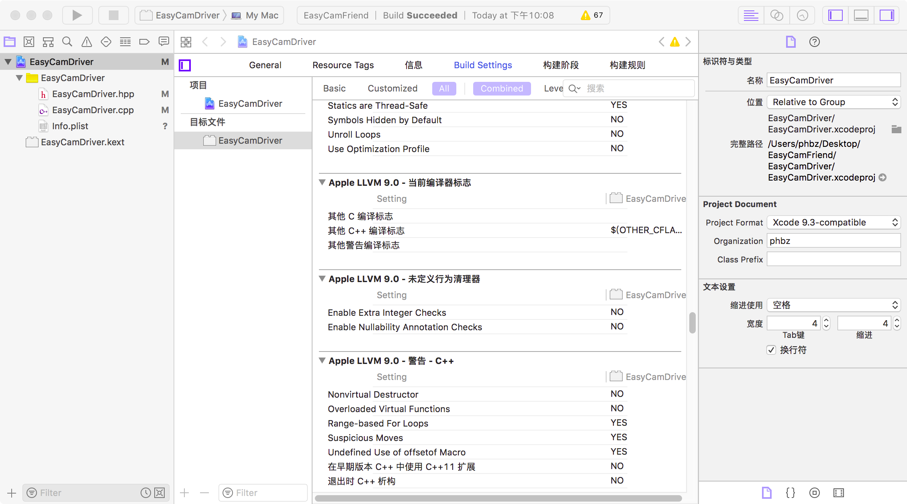

# Xcode-language-pack-cn




一个 Xcode 简体中文汉化包，适用版本如下：

- 已在 Xcode 9.3 测试可用
- Xcode 9.3.x 未测试，大概率可用
- 其他版本不保证可用

虽然支持的版本有限，但本项目欢迎任何人对其进行包括建议、问题反馈和 PR 等在内的
各类贡献，同时作者我也会在本项目后续提交的文档中分享我的知识以帮助你们汉化其他
Xcode 版本或者使用类似方案的 macOS 应用程序。

## 用法

通常来说，只要将对应汉化文件夹复制到对应框架 (插件) 的 `Resources` 文件夹内，并
改名为 `Chinese.lproj`，汉化就应该起作用了。

例如，我有一个IDEKit.framework框架，它位于Xcode的这个位置：

```
/path/to/Xcode/Contents/Frameworks
```

那么，你只需要将汉化文件夹下IDEKit文件夹的内容复制到此路径：

```
/path/to/Xcode/Contents/Frameworks/IDEKit.framework/Resources
```

然后将文件夹改名为`Chinese.lproj`，彻底退出并启动下Xcode程序，对应的汉化应该就起作用了。

## 感谢

- MouriNaruto, https://github.com/MouriNaruto
